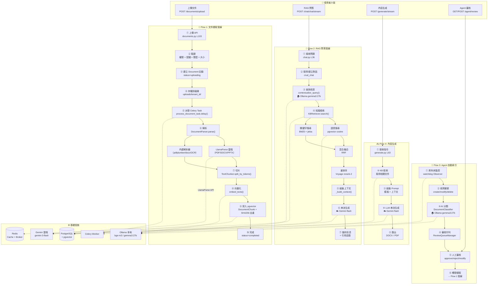

# Enclave 系統核心流程完整分析

本系統是一套**企業私有知識庫 + RAG 問答平台**，共有 **4 條核心流程**、**17 個 API 模組**、**6 層中介軟體**，涉及 **7 種外部服務**。

---

## 系統全貌架構圖



---

## 核心流程一覽

| # | 流程 | 入口 | 涉及模組數 | AI 模型 |
|---|------|------|-----------|---------|
| 1 | 文件擷取管線 | `POST /documents/upload` | 6 | bge-m3 (Ollama) + LlamaParse |
| 2 | RAG 問答管線 | `POST /chat/chat/stream` | 5 | Gemini + bge-m3 + gemma3:27b |
| 3 | Agent 自動索引 | watchdog + `/agent/*` | 5 | gemma3:27b (Ollama) |
| 4 | 內容生成 | `POST /generate/stream` | 4 | Gemini |

---

## Flow 1: 文件擷取管線（最核心）

**完整鏈路：Upload → Validate → Save → Parse → Chunk → Embed → Store**

| 步驟 | 函式 | 檔案 | 行號 | 外部依賴 |
|------|------|------|------|---------|
| ① 上傳 API | `upload_document()` | `app/api/v1/endpoints/documents.py` | L103 | — |
| ② 驗證 | 權限 + 配額 + 類型 + 大小 | `app/api/v1/endpoints/documents.py` | L115 | PostgreSQL |
| ③ 建記錄 | `crud_document.create()` status=`uploading` | `app/api/v1/endpoints/documents.py` | L166 | PostgreSQL |
| ④ 存檔 | `aiofiles.write()` → `uploads/{tenant_id}/` | `app/api/v1/endpoints/documents.py` | L175 | 磁碟 |
| ⑤ 派發任務 | `process_document_task.delay()` | `app/api/v1/endpoints/documents.py` | L179 | Redis/Celery |
| ⑥ 解析 | `DocumentParser.parse()` | `app/services/document_parser.py` | L306 | LlamaParse 雲端 / pdfplumber / OCR |
| ⑥a | → LlamaParse 優先路徑（API key 存在時） | `app/services/document_parser.py` | L322 | LlamaParse API |
| ⑥b | → 內建解析器退回（`_parse_pdf`, `_parse_docx` 等） | `app/services/document_parser.py` | L356 | pdfplumber / python-docx / pytesseract |
| ⑦ 品質報告 | `QualityReport.compute_quality()` | `app/services/document_parser.py` | L195 | — |
| ⑧ 切片 | `TextChunker.split_by_tokens()` (tiktoken 計 token) | `app/services/document_parser.py` | L1311 | tiktoken |
| ⑧a | → 段落偵測 + 標題保護 + 表格保護 | `app/services/document_parser.py` | L1365 | — |
| ⑨ 向量化 | `embed_texts()` → 路由至 Ollama 或 Voyage | `app/tasks/document_tasks.py` | L54 | Ollama bge-m3 |
| ⑨a | → `_embed_ollama()` | `app/tasks/document_tasks.py` | L24 | Ollama |
| ⑨b | → `_embed_voyage()` | `app/tasks/document_tasks.py` | L38 | Voyage AI |
| ⑩ 寫入 | `DocumentChunk` 含 `Vector(1024)` + SHA-256 去重 | `app/tasks/document_tasks.py` | L123 | PostgreSQL + pgvector |
| ⑪ 完成 | status=`completed` + 清除 KB 快取 | `app/tasks/document_tasks.py` | L156 | Redis |

### 外部依賴

- **PostgreSQL + pgvector** — 文件記錄 & 向量儲存（HNSW index, cosine ops）
- **Redis** — Celery broker + KB 搜尋快取失效
- **Ollama** (`bge-m3`) 或 **Voyage AI** (`voyage-4-lite`) — 向量生成
- **LlamaParse** (optional) — 高品質文件解析（PDF, DOCX, PPTX, 圖片）
- **pytesseract** (optional) — OCR 掃描 PDF/圖片退回
- **pdfplumber** — PDF 表格擷取
- **tiktoken** — 精確 token 計數（切片用）

### 關鍵資料模型

| Model | 檔案 |
|-------|------|
| `Document` | `app/models/document.py` L8 |
| `DocumentChunk`（含 `Vector(1024)` 欄位） | `app/models/document.py` L37 |
| `DocumentCreate` / `DocumentUpdate` schemas | `app/schemas/document.py` |
| `QualityReport` | `app/services/document_parser.py` L160 |

### 次要入口：URL 擷取

`process_url_task()` 於 `app/tasks/document_tasks.py` L193 — 相同管線，但使用 `trafilatura` 擷取網頁內容取代檔案解析。

---

## Flow 2: RAG 問答管線（使用者面向核心）

**完整鏈路：Question → Rewrite → Retrieve (Semantic + BM25 + RRF + Rerank) → Generate → Stream**

### 入口端點

1. **`POST /api/v1/chat/chat/stream`** — SSE 串流 — `app/api/v1/endpoints/chat.py` L36
2. **`POST /api/v1/chat/chat`** — 同步（legacy） — `app/api/v1/endpoints/chat.py` L167

### 完整呼叫鏈（串流路徑）

| 步驟 | 函式 | 檔案 | 行號 | AI 模型 |
|------|------|------|------|---------|
| ① 接收問題 | `chat_stream()` | `app/api/v1/endpoints/chat.py` | L36 | — |
| ② 對話管理 | `crud_chat.create_conversation()` | `app/api/v1/endpoints/chat.py` | L68 | — |
| ③ 載入歷史 | `_get_history()` | `app/api/v1/endpoints/chat.py` | L83 | — |
| ④ 查詢改寫 | `contextualize_query()` — 偵測代名詞/指示詞 | `app/services/chat_orchestrator.py` | L215 | **Ollama gemma3:27b** |
| ④a | → 智慧跳過：無代名詞時不呼叫 LLM（省 ~0.9s） | `app/services/chat_orchestrator.py` | L240 | — |
| ④b | → 使用 internal LLM（本地 Ollama）或主 LLM 改寫 | `app/services/chat_orchestrator.py` | L247 | — |
| ⑤ 上下文檢索 | `orchestrator.retrieve_context()` | `app/services/chat_orchestrator.py` | L97 | — |
| ⑤a | → `KnowledgeBaseRetriever.search()` 在 executor 中執行 | `app/services/chat_orchestrator.py` | L112 | — |
| ⑥ KB 檢索 | `KnowledgeBaseRetriever.search()` | `app/services/kb_retrieval.py` | L113 | — |
| ⑥a | → Redis 快取檢查 `_cache_get()` | `app/services/kb_retrieval.py` | L139 | — |
| ⑥b | → **語意搜尋** `_semantic_search()` — pgvector cosine distance | `app/services/kb_retrieval.py` | L210 | **Ollama bge-m3** |
| ⑥b.i | → 嵌入查詢 `embed_texts([query], "query")` | `app/services/kb_retrieval.py` | L224 | — |
| ⑥b.ii | → `DocumentChunk.embedding.cosine_distance(query_embedding)` | `app/services/kb_retrieval.py` | L230 | — |
| ⑥c | → **BM25 關鍵字搜尋** `_keyword_search()` — jieba 分詞 | `app/services/kb_retrieval.py` | L302 | — |
| ⑥d | → **混合 RRF 融合** `_hybrid_search()` — Reciprocal Rank Fusion | `app/services/kb_retrieval.py` | L411 | — |
| ⑥e | → **重排序** `_rerank()` — Voyage rerank-2 API | `app/services/kb_retrieval.py` | L468 | Voyage（條件啟用） |
| ⑥f | → Redis 快取寫入 `_cache_set()` | `app/services/kb_retrieval.py` | L530 | — |
| ⑦ 組裝上下文 | `_build_context()` — 組合來源 + context_parts | `app/services/chat_orchestrator.py` | L140 | — |
| ⑧ SSE 推送 | push `sources` event 到客戶端 | `app/api/v1/endpoints/chat.py` | L104 | — |
| ⑨ 串流生成 | `orchestrator.stream_answer(question, context, history)` | `app/services/chat_orchestrator.py` | L185 | **Gemini flash** |
| ⑨a | → 建構 LLM 訊息 `_build_llm_messages()` — system prompt + history + context | `app/services/chat_orchestrator.py` | L363 | — |
| ⑨b | → `AsyncOpenAI.chat.completions.create(stream=True)` | `app/services/chat_orchestrator.py` | L203 | — |
| ⑨c | → 透過 SSE yield token chunks | `app/api/v1/endpoints/chat.py` | L110 | — |
| ⑩ 解析建議 | `_parse_suggestions(full_answer)` | `app/api/v1/endpoints/chat.py` | L114 | — |
| ⑪ 儲存訊息 | `crud_chat.create_message()` | `app/api/v1/endpoints/chat.py` | L122 | — |
| ⑫ 儲存追蹤 | `crud_chat.create_retrieval_trace()` | `app/api/v1/endpoints/chat.py` | L129 | — |
| ⑬ 記錄用量 | `log_usage()` | `app/api/v1/endpoints/chat.py` | L147 | — |

### 同步路徑差異

同步 `chat()` 端點 `app/api/v1/endpoints/chat.py` L167 呼叫：
1. `try_structured_answer()` — `app/services/structured_answers.py` — 處理表格/計算型查詢（員工名冊、薪資）直接計算不經 LLM
2. `orchestrator.process_query()` — `app/services/chat_orchestrator.py` L271 — 檢索上下文 + 同步生成 `_generate_answer_sync()` L425

### LLM Provider 路由

`ChatOrchestrator` 於 `app/services/chat_orchestrator.py` L55 配置**兩個** LLM 客戶端：
- **主 LLM**（使用者面向回答）：OpenAI (`gpt-4o-mini`) 或 Gemini (`gemini-3-flash-preview`) 透過 OpenAI 相容 API
- **內部 LLM**（查詢改寫、輕量任務）：Ollama (`gemma3:27b` via `host.docker.internal:11434`)

### 外部依賴

- **PostgreSQL + pgvector** — 向量相似度搜尋（cosine distance）、對話/訊息儲存
- **Redis** — 搜尋結果快取（TTL 300s）、Celery broker
- **Ollama** (`bge-m3`) 或 **Voyage AI** (`voyage-4-lite`) — 查詢嵌入
- **OpenAI** / **Gemini**（透過 OpenAI SDK）— LLM 回答生成（串流）
- **Ollama** (`gemma3:27b`) — 內部查詢改寫
- **Voyage AI** (`rerank-2`) — 結果重排序
- **jieba** — 中文分詞（BM25 用）
- **rank_bm25** — BM25 關鍵字搜尋

### 關鍵資料模型

| Model | 檔案 |
|-------|------|
| `Conversation` | `app/models/chat.py` L7 |
| `Message` | `app/models/chat.py` L22 |
| `RetrievalTrace` | `app/models/chat.py` L34 |
| `ChatRequest` / `ChatResponse` schemas | `app/schemas/chat.py` |
| `DocumentChunk`（讀取用） | `app/models/document.py` L37 |

---

## Flow 3: Agent 自動索引管線

**完整鏈路：Watch → Detect → Classify → Review → Approve → Ingest (→ Flow 1)**

### 入口端點

| 端點 | 方法 | 路徑 | 檔案 | 行號 |
|------|------|------|------|------|
| Agent 狀態 | GET | `/api/v1/agent/status` | `app/api/v1/endpoints/agent.py` | L138 |
| 列出資料夾 | GET | `/api/v1/agent/folders` | `app/api/v1/endpoints/agent.py` | L170 |
| 新增資料夾 | POST | `/api/v1/agent/folders` | `app/api/v1/endpoints/agent.py` | L182 |
| 手動掃描 | POST | `/api/v1/agent/scan` | `app/api/v1/endpoints/agent.py` | — |
| 審核列表 | GET | `/api/v1/agent/review` | `app/api/v1/endpoints/agent.py` | — |
| 核准項目 | POST | `/api/v1/agent/review/{id}/approve` | `app/api/v1/endpoints/agent.py` | — |
| 駁回項目 | POST | `/api/v1/agent/review/{id}/reject` | `app/api/v1/endpoints/agent.py` | — |
| 修改後核准 | POST | `/api/v1/agent/review/{id}/modify` | `app/api/v1/endpoints/agent.py` | — |
| 批次核准 | POST | `/api/v1/agent/review/batch-approve` | `app/api/v1/endpoints/agent.py` | — |

### A) 啟動 & 檔案監控

| 步驟 | 描述 | 檔案 | 行號 |
|------|------|------|------|
| ① | App 啟動 lifespan 呼叫 `start_agent_watcher()` | `app/main.py` | L26 |
| ② | `start_agent_watcher()` 讀取 `AGENT_WATCH_FOLDERS`，建立 `FolderWatcher` | `app/agent/file_watcher.py` | L228 |
| ③ | `FolderWatcher.start()` — 解析預設 tenant/user，建立 `Observer` | `app/agent/file_watcher.py` | L158 |
| ④ | `_FileChangeHandler` 註冊 watchdog — 監聽 create/modify/delete/move | `app/agent/file_watcher.py` | L80 |
| ⑤ | Debounce (5s)：`_schedule()` → `_fire()` | `app/agent/file_watcher.py` | L87-L107 |
| ⑥ | 觸發 `watcher_ingest_file_task.delay()` 或 `watcher_delete_file_task.delay()` | `app/agent/file_watcher.py` | L100 |
| ⑦ | 啟動後 15s：`FolderWatcher.initial_scan()` — 排入所有既有檔案 | `app/agent/file_watcher.py` | L191 |

### B) 排程器（每日重建）

| 步驟 | 描述 | 檔案 | 行號 |
|------|------|------|------|
| ① | App 啟動呼叫 `start_agent_scheduler()` | `app/main.py` | L33 |
| ② | `BatchScheduler.start_scheduled_job()` — APScheduler CronTrigger 於 `AGENT_BATCH_HOUR` | `app/agent/scheduler.py` | L63 |
| ③ | `_run_daily_rebuild()` — CPU 檢查 → 建立臨時 `FolderWatcher` → 呼叫 `initial_scan()` | `app/agent/scheduler.py` | L100 |

### C) Celery 擷取任務（從 watcher）

| 步驟 | 函式 | 檔案 | 行號 |
|------|------|------|------|
| ① | `watcher_ingest_file_task()` | `app/tasks/document_tasks.py` | L397 |
| ② | 檢查此 `file_path` 是否已有 Document | `app/tasks/document_tasks.py` | L420 |
| ③a | 已存在且未變更 → 跳過 (`skip_if_current`) | `app/tasks/document_tasks.py` | L429 |
| ③b | 已存在且已修改 → 刪除舊 chunks，重設狀態 | `app/tasks/document_tasks.py` | L437 |
| ③c | 新檔 → 建立 `Document` 記錄 | `app/tasks/document_tasks.py` | L448 |
| ④ | 派發 `process_document_task.delay(doc_id, file_path, tenant_id)` | `app/tasks/document_tasks.py` | L462 |
| ⑤ | → 同 Flow 1 管線（parse → chunk → embed → pgvector） | | |

### D) 分類 + 審核佇列

| 步驟 | 函式 | 檔案 | 行號 |
|------|------|------|------|
| ① | `DocumentClassifier.classify_file(file_path)` | `app/agent/classifier.py` | L103 |
| ② | `_parse_filename()` — 正規表示式提取日期、姓名、文件類型、狀態 | `app/agent/classifier.py` | L128 |
| ③ | `_analyze_content_head()` — 讀取檔案前 1200 字元 | `app/agent/classifier.py` | L155 |
| ④ | `_llm_classify()` — 送出檔名 + 內容片段給 LLM，取得 JSON 回應 | `app/agent/classifier.py` | L237 |
| ④a | 無 LLM 時退回 `_rule_classify()`（關鍵字比對） | `app/agent/classifier.py` | L206 |
| ⑤ | 回傳 `ClassificationProposal`（category, subcategory, tags, confidence, reasoning） | `app/agent/classifier.py` | L80 |
| ⑥ | `ReviewQueueManager.enqueue(proposal, tenant_id)` — 建立 `ReviewItem` | `app/agent/review_queue.py` | L38 |
| ⑥a | `_find_related()` — 跨文件關聯偵測（同一人/日期+分類） | `app/agent/review_queue.py` | L72 |
| ⑦ | 人工審核 API：`approve()` / `reject()` / `modify_and_approve()` | `app/agent/review_queue.py` | L117-L165 |
| ⑧ | 核准後：`_trigger_indexing()` → 呼叫 `watcher_ingest_file_task.delay()` | `app/agent/review_queue.py` | L196 |

### 外部依賴

- **watchdog** — 檔案系統事件監控
- **APScheduler** — 每日 cron 觸發批次重建
- **psutil** — CPU 使用率監控（批次節流）
- **Ollama/OpenAI/Gemini**（透過 `LLMClient`）— AI 檔案分類
- **Celery + Redis** — 非同步任務派發
- **PostgreSQL** — WatchFolder、ReviewItem 儲存

### 關鍵資料模型

| Model | 檔案 |
|-------|------|
| `WatchFolder` | `app/models/watch_folder.py` |
| `ReviewItem` | `app/models/review_item.py` |
| `ClassificationProposal`（dataclass） | `app/agent/classifier.py` L80 |

---

## Flow 4: 內容生成管線

**完整鏈路：Request → KB Retrieval → Template + Context → LLM Stream → Export**

### 入口端點

| 端點 | 方法 | 路徑 | 檔案 | 行號 |
|------|------|------|------|------|
| 串流生成 | POST | `/api/v1/generate/stream` | `app/api/v1/endpoints/generate.py` | L63 |
| 列出模板 | GET | `/api/v1/generate/templates` | `app/api/v1/endpoints/generate.py` | L53 |
| 匯出 DOCX | POST | `/api/v1/generate/export/docx` | `app/api/v1/endpoints/generate.py` | L142 |
| 匯出 PDF | POST | `/api/v1/generate/export/pdf` | `app/api/v1/endpoints/generate.py` | L158 |

### 完整呼叫鏈（串流生成）

| 步驟 | 函式 | 檔案 | 行號 |
|------|------|------|------|
| ① | `generate_stream()` | `app/api/v1/endpoints/generate.py` | L63 |
| ② | Auth 驗證 | — | — |
| ③ | 若提供 `document_ids`：從 DB 取 `DocumentChunk` 文字作為 `extra_context` | `app/api/v1/endpoints/generate.py` | L85 |
| ④ | 建立 `ContentGenerator` 透過 `_get_generator()` — 注入 `LLMClient` + `KBRetriever` | `app/api/v1/endpoints/generate.py` | L34 |
| ⑤ | `ContentGenerator.generate_stream()` | `app/services/content_generator.py` | L56 |
| ⑤a | → KB 檢索：`retriever.search(tenant_id, context_query, top_k=5)` | `app/services/content_generator.py` | L81 |
| ⑤b | → 建構 system prompt：`_get_system_prompt(template)` | `app/services/content_generator.py` | L226 |
| ⑤c | → 合併 extra_context + KB context 到 system prompt | `app/services/content_generator.py` | L103 |
| ⑤d | → LLM 串流：`llm_client.stream(system_prompt, user_prompt)` | `app/services/content_generator.py` | L113 |
| ⑥ | `LLMClient.stream()` 路由到 OpenAI/Gemini 或 Ollama | `app/services/llm_client.py` | L126 |
| ⑥a | → `_openai_stream()` — `AsyncOpenAI.chat.completions.create(stream=True)` | `app/services/llm_client.py` | L138 |
| ⑥b | → `_ollama_stream()` — `httpx.AsyncClient.stream("POST", .../api/chat)` | `app/services/llm_client.py` | L152 |
| ⑦ | 生成後附加引用列表 | `app/services/content_generator.py` | L120 |
| ⑧ | 記錄用量 `log_usage()` | `app/api/v1/endpoints/generate.py` | L120 |

### 模板（5 種）

定義於 `app/services/content_generator.py` L40：
- `draft_response` — 正式信函/回覆草擬
- `case_summary` — 案件摘要
- `meeting_minutes` — 會議紀錄
- `analysis_report` — 跨案分析報告
- `faq_draft` — FAQ 生成

### 匯出功能

- **DOCX**：`export_to_docx()` 使用 `python-docx` — `app/services/content_generator.py` L132
- **PDF**：`export_to_pdf()` 使用 `reportlab` — `app/services/content_generator.py` L175

### 外部依賴

- **OpenAI / Gemini / Ollama** — LLM 生成（透過統一 `LLMClient`）
- **pgvector** — KB 檢索 RAG 上下文
- **python-docx** — Word 匯出
- **reportlab** — PDF 匯出

---

## Flow 5: 支撐基礎設施

### A) 應用程式啟動 — `app/main.py`

**中介軟體堆疊**（反序套用 — 最後新增 = 最先執行）：

| 順序 | 中介軟體 | 檔案 | 用途 |
|------|---------|------|------|
| 1 | `RateLimitMiddleware` | `app/middleware/rate_limit.py` | Redis 滑動窗口 per-IP 速率限制 |
| 2 | `PrometheusMiddleware` | `app/middleware/metrics.py` | `http_requests_total`, `http_request_duration_seconds`, `http_requests_in_progress` |
| 3 | `RequestLoggingMiddleware` | `app/middleware/request_logging.py` | Request ID 生成、JWT 使用者上下文提取、計時 |
| 4 | `AdminIPWhitelistMiddleware` | `app/middleware/ip_whitelist.py` | 限制 `/api/v1/admin/*` 和 `/api/v1/analytics/*` 到白名單 IP |
| 5 | `APIVersionMiddleware` | `app/middleware/versioning.py` | 加入 `X-API-Version`, `Deprecation`, `Sunset` headers |
| 6 | `CORSMiddleware` | （FastAPI 內建） | 跨域資源共享 |

**Lifespan 事件**（`app/main.py` L19）：
- Startup：`start_agent_watcher()`, `start_agent_scheduler()`
- Shutdown：`stop_agent_watcher()`, `stop_agent_scheduler()`

**特殊端點**：
- `GET /` — 根資訊
- `GET /health` — 健康檢查
- `GET /metrics` — Prometheus 抓取
- `GET /api/versions` — 支援的 API 版本

### B) 路由註冊 — `app/api/v1/api.py`

| 前綴 | 標籤 | 模組 |
|------|------|------|
| `/auth` | auth | `auth.py` |
| `/users` | users | `users.py` |
| `/documents` | documents | `documents.py` |
| `/kb` | knowledge-base | `kb.py` |
| `/chat` | chat | `chat.py` |
| `/audit` | audit | `audit.py` |
| `/departments` | departments | `departments.py` |
| `/admin` | admin | `admin.py` |
| `/feature-flags` | feature-flags | `feature_flags.py` |
| `/analytics` | analytics | `analytics.py` |
| `/organization` | organization | `tenants.py` |
| `/agent` | agent | `agent.py` |
| `/generate` | generate | `generate.py` |
| `/mobile` | mobile | `mobile.py` |
| `/kb-maintenance` | kb-maintenance | `kb_maintenance.py` |
| `/company` | company | `company.py` |
| `/sso` | sso | `sso.py` |

### C) 認證 & 安全 — `app/core/security.py`

- **密碼雜湊**：bcrypt via `passlib`
- **JWT tokens**：`jose.jwt` with HS256，可設定過期時間（`ACCESS_TOKEN_EXPIRE_MINUTES` 預設 8 天）
- **認證依賴鏈**：`app/api/deps.py`
  - `get_db()` → yields `SessionLocal`
  - `get_current_user()` → 解碼 JWT，透過 email 查詢使用者
  - `get_current_active_user()` → 檢查 `user.is_active`

### D) 資料庫設定 — `app/db/session.py`

- **Engine**：SQLAlchemy `create_engine` with PostgreSQL
- **連線池**：`pool_size=10`, `max_overflow=20`, `pool_recycle=1800s`, `pool_pre_ping=True`
- **慢查詢監控**：SQLAlchemy event listeners 記錄超過 `SLOW_QUERY_THRESHOLD_MS`（500ms 預設）的查詢
- **Pool 狀態追蹤**：記錄 checkout events 與 pool stats
- **Base class**：`app/db/base_class.py` — 從 class name 自動生成 `__tablename__`

### E) Celery Worker — `app/celery_app.py`

- Broker：Redis
- 自動探索 `app/tasks/` 中的任務
- 明確匯入 `document_tasks` 和 `kb_maintenance_tasks`
- JSON 序列化，UTC 時區

### F) 設定 — `app/config.py`

`Settings`（Pydantic BaseSettings）從 `.env` 載入，主要設定群組：
- **DB**：`POSTGRES_*`、pool 調校
- **Redis**：`REDIS_HOST`, `REDIS_PORT`
- **Embedding**：`EMBEDDING_PROVIDER` (ollama/voyage), `OLLAMA_EMBED_URL`, `VOYAGE_API_KEY`
- **LLM**：`LLM_PROVIDER` (openai/gemini/ollama), `INTERNAL_LLM_PROVIDER`
- **解析**：`LLAMAPARSE_API_KEY`、chunking 參數
- **Agent**：`AGENT_WATCH_ENABLED`, `AGENT_WATCH_FOLDERS`, `AGENT_BATCH_HOUR`
- **安全**：production 驗證器在啟動時阻擋不安全的 secrets

### G) LLM 客戶端 — `app/services/llm_client.py`

透過統一介面支援三種 provider：

| Provider | SDK | 模型 |
|----------|-----|------|
| `openai` | `openai` Python SDK | `gpt-4o-mini`（預設） |
| `gemini` | `openai` SDK + Gemini base URL | `gemini-3-flash-preview` |
| `ollama` | `httpx` 直接 HTTP | `llama3.2`（預設） |

提供 `complete()`（同步）和 `stream()`（async generator）方法。全域延遲單例透過 `get_llm()` / `llm`。

支援參數覆蓋：`LLMClient(provider="ollama", model="gemma3:27b", base_url="...")` — 用於內部任務使用不同的 LLM。

### H) 結構化回答 — `app/services/structured_answers.py`

繞過 LLM 直接計算結構化資料查詢：
- `EmployeeRoster` — 解析員工名冊 CSV/markdown 表格，回答人數、薪資、年資問題
- `PayrollSlip` — 解析薪資文件直接提取數據
- 作為同步聊天路徑的第一檢查，LLM 前的退回

---

## 目錄清單

### `app/api/v1/endpoints/`

`admin.py`, `agent.py`, `analytics.py`, `audit.py`, `auth.py`, `chat.py`, `company.py`, `departments.py`, `documents.py`, `feature_flags.py`, `generate.py`, `kb.py`, `kb_maintenance.py`, `mobile.py`, `sso.py`, `tenants.py`, `users.py`

### `app/services/`

`chat_orchestrator.py`, `content_generator.py`, `document_parser.py`, `feature_flags.py`, `kb_retrieval.py`, `llm_client.py`, `structured_answers.py`

### `app/tasks/`

`document_tasks.py`, `kb_maintenance_tasks.py`

### `app/agent/`

`classifier.py`, `file_watcher.py`, `review_queue.py`, `scheduler.py`, `tool_registry.py`

### `app/middleware/`

`ip_whitelist.py`, `metrics.py`, `rate_limit.py`, `request_logging.py`, `versioning.py`

### `app/core/`

`security.py`

### `app/models/`

`audit.py`, `chat.py`, `document.py`, `feature_flag.py`, `feedback.py`, `kb_maintenance.py`, `permission.py`, `review_item.py`, `tenant.py`, `user.py`, `watch_folder.py`

### `app/schemas/`

`audit.py`, `chat.py`, `document.py`, `feature_flag.py`, `kb_maintenance.py`, `permission.py`, `sso.py`, `tenant.py`, `token.py`, `user.py`

### `app/crud/`

`crud_audit.py`, `crud_chat.py`, `crud_document.py`, `crud_permission.py`, `crud_tenant.py`, `crud_user.py`

### `app/db/`

`base_class.py`, `session.py`, `migrations/`

---

## 自動化測試腳本

系統提供 **9 個端對端測試腳本**，涵蓋 ~175 項測試，覆蓋 ~95% 的 API 端點（~100/105）。所有腳本使用 `requests` 直接呼叫運行中的 Docker 服務（非 mock），可透過 Master Runner 一鍵執行。

### 腳本清單

| # | 腳本路徑 | 測試項目 | 說明 |
|---|---------|---------|------|
| — | `scripts/test_infra_health.py` | 8 項 | **基礎設施健康檢查** — API 啟動、PostgreSQL、Redis、Celery、Ollama（LLM + Embedding）、Gemini、LlamaParse |
| 1 | `scripts/test_flow1_ingestion.py` | 17 項 | **文件攝取管線** — 上傳 .md/.csv/.txt → 輪詢處理 → Chunk 驗證 → 品質報告 → 搜尋 → 刪除 |
| 2 | `scripts/test_flow2_rag_chat.py` | 18 項 | **RAG 問答管線** — 同步/SSE 串流對話、多輪上下文、KB 搜尋、回饋評分 |
| 3 | `scripts/test_flow3_agent.py` | 17 項 | **Agent 自動索引** — 資料夾 CRUD、掃描、分類、審核佇列、核准/駁回/修改、批次處理 |
| 4 | `scripts/test_flow4_generation.py` | 17 項 | **內容生成** — 5 種模板（onboarding/SOP/FAQ/report/training）產出、DOCX/PDF 匯出、結果自動存檔至 `test-results/` |
| 5 | `scripts/test_flow5_bulk_agent.py` | 22 項 | **50+ 大量 Agent** — 23 真實 + 27+ 生成檔案、全 Agent 管線、批次核准、建索引、搜尋驗證 |
| 6 | `scripts/test_flow6_platform_admin.py` | 35 項 | **平台管理 & 權限** — Users/me、Admin Dashboard、User CRUD、Quota 管理、Security 設定、Departments CRUD + Tree + Features、Feature Flags CRUD + Evaluate、Organization、Company |
| 7 | `scripts/test_flow7_analytics_audit.py` | 23 項 | **分析 & 稽核** — Audit Logs/Export、Usage 統計、Chat Analytics（摘要/趨勢/熱門/未回答）、RAG Dashboard、Feedback Stats、KB Stats、Platform Analytics |
| 8 | `scripts/test_flow8_kb_maintenance.py` | 20 項 | **知識庫維護** — 文件版本/重上傳/Diff、KB Health、知識缺口（列表/掃描/解決）、分類 CRUD + 修訂 + 回滾、完整性掃描/報告、備份/還原、使用量報表 |

### 主控腳本

| 腳本路徑 | 說明 |
|---------|------|
| `scripts/test_master_runner.py` | **全流程主控** — 依序執行上述所有套件，彙整結果報告；支援 `--skip`/`--only` 選擇性執行、`--keep` 保留測試資料 |

### 執行方式

```bash
# 全部執行
python scripts/test_master_runner.py

# 指定 base URL
python scripts/test_master_runner.py --base-url http://1.2.3.4:8001

# 僅執行特定流程
python scripts/test_master_runner.py --only flow1 flow2 flow6

# 跳過大量測試
python scripts/test_master_runner.py --skip flow5

# 單獨執行（保留資料）
python scripts/test_flow6_platform_admin.py --keep
```

### 未覆蓋區域（~5%）

| 區域 | 端點數 | 原因 |
|------|--------|------|
| Mobile | 6 | 需裝置端 push token / 憑證指紋，無法在 CLI 模擬 |
| SSO | 2 | 骨架端點，需第三方 IdP 整合 |

---

## AI 模型分配表（當前配置）

| 場景 | Provider | 模型 | 理由 |
|------|----------|------|------|
| RAG 問答 | **Gemini**（雲端） | gemini-3-flash-preview | 使用者面向，品質關鍵 |
| 內容生成 | **Gemini**（雲端） | gemini-3-flash-preview | 使用者面向，寫作品質 |
| 文件分類 | **Ollama**（本地） | gemma3:27b | 內部任務，簡單 |
| 查詢改寫 | **Ollama**（本地） | gemma3:27b | 內部任務，簡單 |
| 資料夾掃描 | **Ollama**（本地） | gemma3:27b | 內部任務 |
| 向量嵌入 | **Ollama**（本地） | bge-m3 (1024d) | 免費，品質夠用 |
| PDF 解析 | **LlamaParse**（雲端） | — | 無本地替代方案 |
| 重排序 | **Voyage**（雲端） | rerank-2 | 條件啟用 |

---

## 一句話總結

> 所有流程的交匯點是 **`DocumentChunk` + pgvector** — 文件擷取管線負責寫入、問答/生成管線負責讀取，這是整個系統的核心資料結構。
